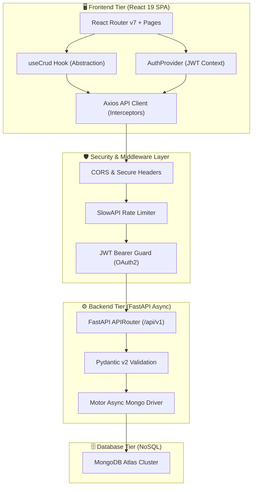
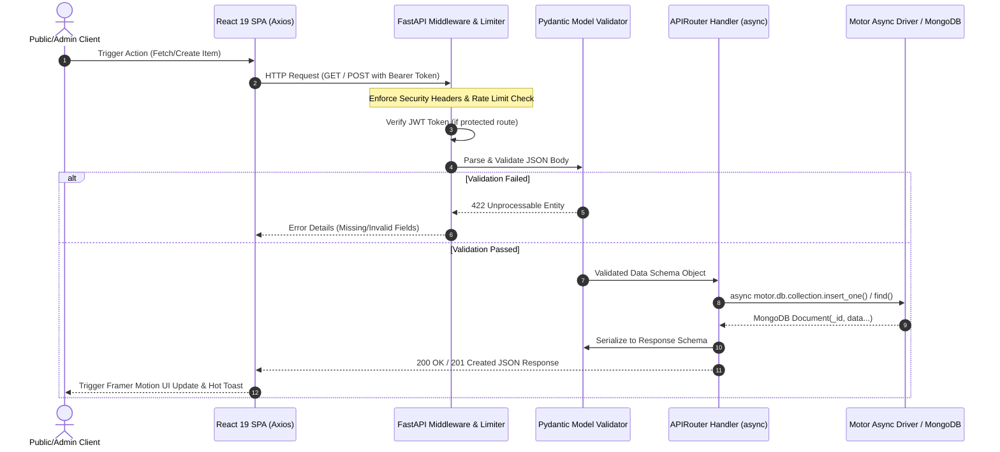
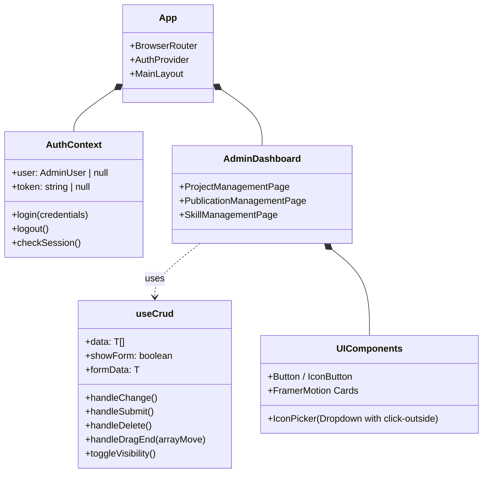

# 🏗️ System Architecture & Data Flow Engineering

This document provides a comprehensive technical breakdown of the full-stack architecture, asynchronous data pipelines, and state management lifecycles that power the Personal Web Platform and Admin Engine.

---

## 🌐 High-Level System Architecture

The platform follows a clean two-tier decoupled architecture:
1. **Frontend Tier (Client)**: A React 19 Single Page Application (SPA) bundled with Vite 6 and styled using Tailwind CSS v4 and Framer Motion.
2. **Backend Tier (API Server)**: An asynchronous FastAPI service running on Python 3.11+, using the `motor` asynchronous MongoDB driver for non-blocking I/O.

---

## ⚡ Asynchronous Request Lifecycle

Every HTTP request traverses a strict validation and security pipeline before reaching the database. Below is the sequence flow for both public queries and protected admin mutations:

---

## 🧩 Frontend Component Hierarchy & State Layer

To keep page components lightweight and maintain strict separation of concerns, global state and data manipulation are separated into dedicated layers:

---

## 🔐 Authentication & Session Security Flow

The administrative dashboard (`/secure-control`) enforces strict authentication guards:
1. **Login Handshake**: Admin submits credentials to `/api/auth/login`. Password is verified against `Bcrypt` hashed strings stored in MongoDB (`users` collection).
2. **Token Generation**: Upon verification, a signed JSON Web Token (`JWT`) is issued with an expiration window and custom claims.
3. **Route Guarding**: The frontend `ProtectedRoute` wrapper verifies the token signature via `/api/auth/me` on reload and redirects unauthenticated requests immediately to `/login`.
4. **Inactivity Timeout**: Client-side activity listeners monitor mouse and keyboard interaction; extended idle windows trigger an automated logout and token purge.

---

## 🏃 Dual-Server Orchestration (`run.py`)

For local development and testing across environments, the platform includes a Python orchestration runner (`run.py`) that synchronizes the startup, process monitoring, and graceful termination of both frontend and backend services via `subprocess.Popen` chaining:
- Automatically activates `venv` and starts `uvicorn app.main:app --reload` for the API.
- Spawns `npm run dev -- --host` for the Vite development server.
- Captures termination signals (`SIGINT` / `KeyboardInterrupt`) to cleanly shut down all child worker processes without port zombie hanging.
